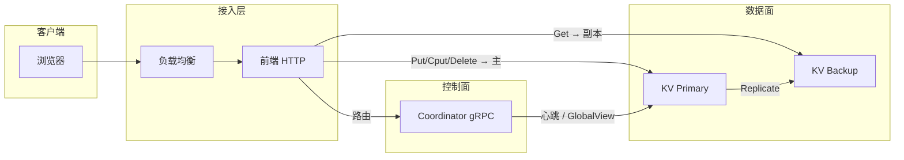
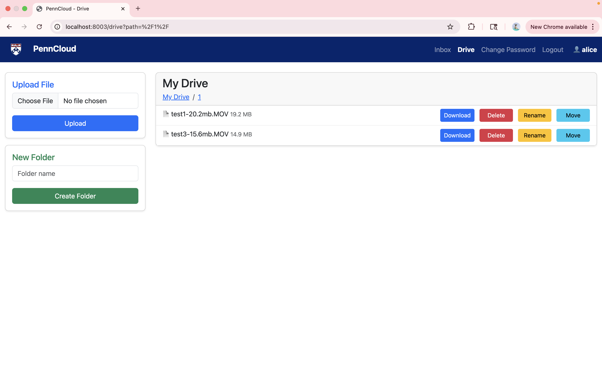
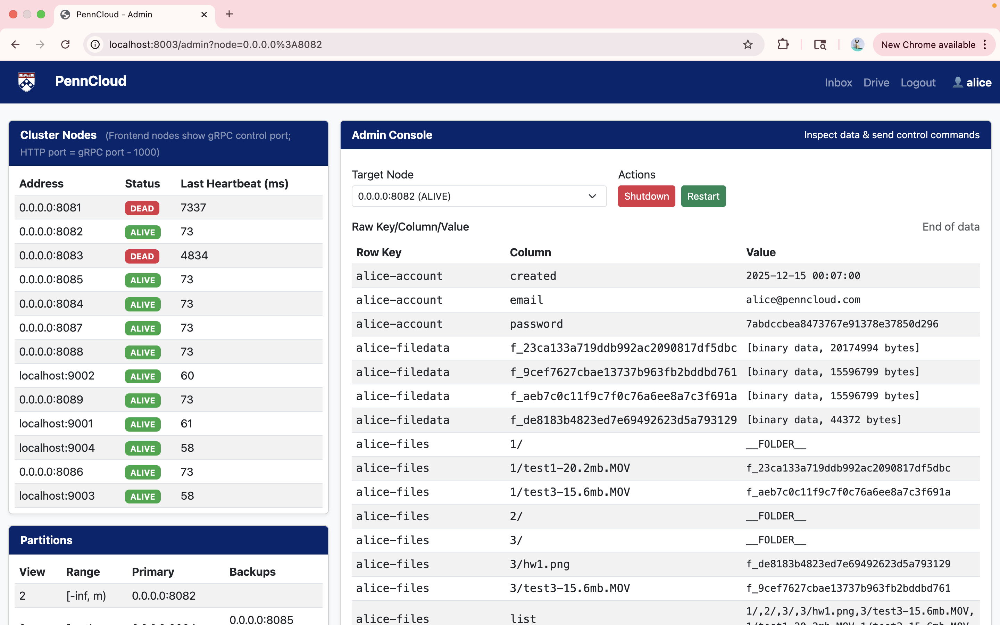
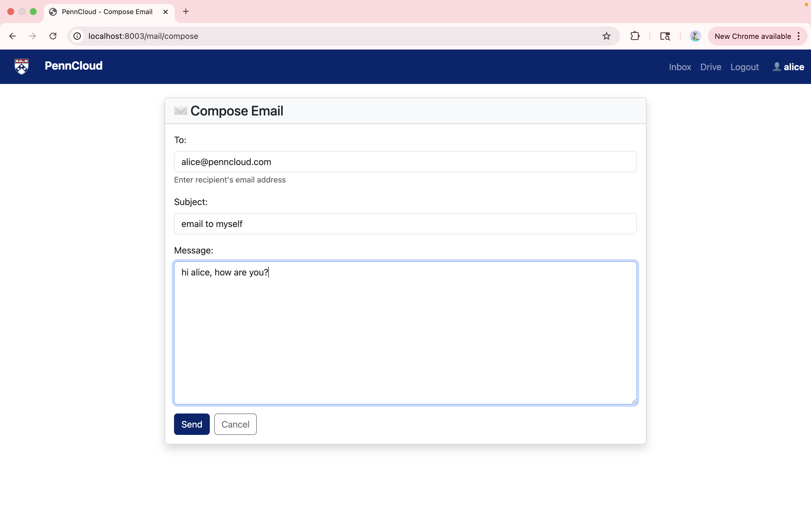
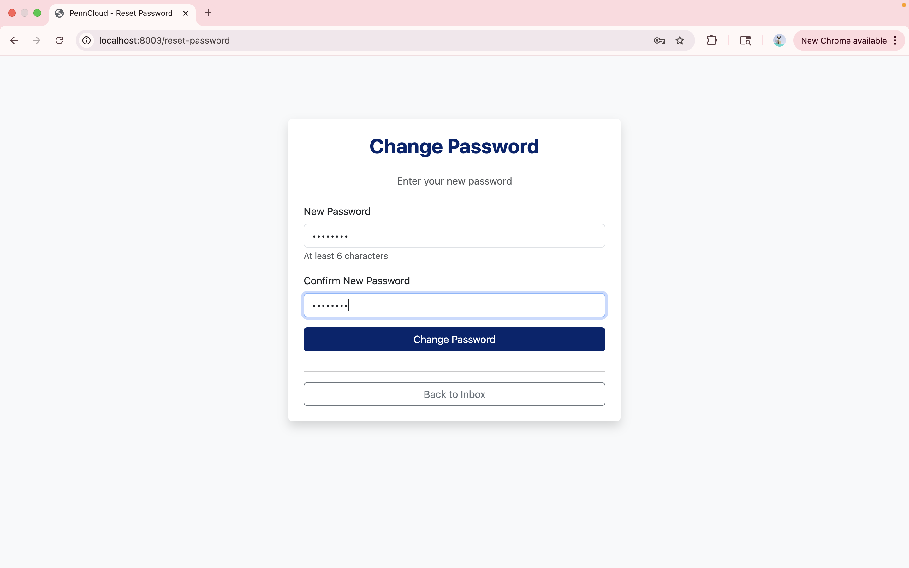

# 分布式云存储系统

教学/作品集用的 **分布式键值与网盘存储** 全栈：多副本 **Tablet** 存储节点、按 **row key 范围** 路由的 **Coordinator**、**WAL + Checkpoint** 崩溃恢复，以及 **无状态 Web 层**（网盘、邮件、管理台、负载均衡、可选 SMTP）。

---

## 仓库结构

```
.
├── CMakeLists.txt              # 顶层构建（工程名：distributed-cloud-storage）
├── cluster_config.csv          # 静态分区 [start,end) → primary / backups
├── proto/myproto/              # gRPC：KvStorage、Coordinator
├── server/src/                 # KV 节点、协调器、路由、tablet、wal、checkpoint、recovery
├── client/src/                 # KvStorageClient（路由与重试）
├── frontend/                   # HTTP、存储逻辑、账号、LB、SMTP、管理台
├── pages/                      # 静态页面
├── docs/                       # 可选本地笔记（若在 .gitignore 中则不入库）
├── Dockerfile                  # 开发镜像：源码编译 gRPC/Protobuf 安装到 /usr/local
├── run_docker_local.sh         # 推荐：本地容器开发
└── run_docker.sh               # 可选：换成你自己的工具链镜像
```

---

## 架构概览



| 组件 | 作用 |
|------|------|
| **Coordinator** | 读取 `cluster_config.csv`，心跳检测，下发 **GlobalView**（每个范围对应 primary + backups）。 |
| **KV `server`** | 内存 **Tablet**，**WAL** + **checkpoint**，写 **同步 Replicate** 到备份节点。 |
| **Frontend** | 线程池 HTTP；网盘通过 **KvStorageClient** 按 **row** 路由。 |
| **Client 库** | `GetClusterStatus` 建连接；写打 **primary**，读可走存活副本。 |

---

## 持久化：Checkpoint 与 WAL（磁盘格式）

每个节点按监听地址生成独立文件（文件名里多为端口）：`checkpoint-<port>.bin`、`wal-<port>.log`。

### Checkpoint 文件（二进制，`checkpoint.cpp`）

**原子写入**：先写 `*.tmp`，再 `rename` 覆盖正式文件，避免读到半截文件。

| 字段 | 类型 | 含义 |
|------|------|------|
| `snapshot_lsn` | `int64` | **快照对应的 Tablet 状态与 WAL LSN 对齐**；恢复时只重放 **`lsn` 严格大于** 该值的 WAL 记录。 |
| `row_count` | `uint32` | 行数。 |
| 每行 | | |
| `row` | `uint32` 长度 + 字节 | 行键。 |
| `col_count` | `uint32` | 该行列数。 |
| 每列 | | |
| `col` | `uint32` 长度 + 字节 | 列键。 |
| `val` | `uint32` 长度 + 字节 | 单元值（二进制安全）。 |

### WAL 记录（二进制，`wal.cpp`）

追加日志；每条记录写入后对日志文件 **fsync**（主路径上尽量保证落盘后再响应）。

| 字段 | 类型 | 含义 |
|------|------|------|
| `op` | `int` | `1`=PUT，`2`=DELETE，`3`=CPUT（与 recovery 中枚举一致）。 |
| `row` | `uint32` 长度 + 字节 | 行键。 |
| `col` | `uint32` 长度 + 字节 | 列键。 |
| `v_old` | `uint32` 长度 + 字节 | CPUT 期望值（PUT/DELETE 可为空）。 |
| `v_new` | `uint32` 长度 + 字节 | PUT/CPUT 新值（DELETE 可为空）。 |
| `lsn` | `int64` | 单调日志序号（`Append` 时若传入 `0` 则自动分配）。 |

### 恢复（`recovery.cpp`）

**LocalRecover（本机）**

1. `CheckpointManager::Load` → 填充 tablet，记录 `last_snapshot_lsn_`。  
2. `WAL::LoadAll` → 对每条满足 **`lsn > checkpoint_lsn`** 的记录，在 tablet 上执行 PUT/DELETE/CPUT（与在线路径语义一致）。

**RemoteRecoverFromPrimary（备份追赶主）**

1. 流式 `FetchSnapshot` → 暂存快照；最后一条带 `snapshot_lsn`。  
2. 加锁：`wal.Clear()`、`wal.ResetToLSN(snapshot_lsn)`、`tablet.Clear()`，再写入快照单元。  
3. 分页 `FetchWAL`，从 `snapshot_lsn + 1` 起拉日志，应用到 tablet 并 **重新 Append 到本地 WAL**。  
4. `checkpoint.Save(tablet, wal_.GetLastLSN())`。

### 后台 Checkpoint 线程（`kv_server.cpp` — `CheckpointLoop`）

- 约每 **120 秒**（运行中）：`checkpoint_mgr_.Save(tablet, wal_.GetLastLSN())`，然后 **`wal_.Clear()`** 截断 WAL 文件（**内存里的 `last_lsn_` 不重置**，见 `wal.h`）。  
- 截断后 WAL 只保留 **checkpoint 之后** 的增量；恢复策略仍是「先快照，再追尾巴」。

---

## 数据模型（Tablet 与网盘）

- **Tablet**：`(row, col)` 上的 `Put/Get/Cput/Delete`；行级 `shared_mutex` + 全局行索引锁。  
- **网盘**（`frontend/storage.cc`）：路径 → `file_id`；文件内容按 **4 MiB** 分块，行键 **`file_id:block_index`**，列 **`b`**；旧数据可能整文件存在 `{user}-filedata` / `file_id`（兼容读取）。

---

## 作者

Yuxin Gao, Yikai Ding, Zihao Zhu, Xiaocheng Li.

---

## 编译

需要 **CMake ≥ 3.13**、**C++17**、带 **CMake CONFIG** 的 **gRPC** 与 **Protobuf**（如 Homebrew，或本仓库 **Dockerfile**）。

```bash
cmake -S . -B build
cmake --build build
```

### Docker（宿主机缺 CONFIG 包时推荐）

首次构建会从源码编译 gRPC，较慢，只需一次：

```bash
chmod +x run_docker_local.sh
./run_docker_local.sh
```

容器内（使用独立构建目录，避免与 macOS 宿主机路径混用 CMake 缓存）：

```bash
cmake -S . -B build-docker && cmake --build build-docker
```

默认镜像名 **`cloud-storage-dev`**（可用环境变量 `CLOUD_STORAGE_DEV_IMAGE` 覆盖）。强制重建镜像：`./run_docker_local.sh --build`。

### macOS（Homebrew）

```bash
brew install cmake grpc protobuf
export CMAKE_PREFIX_PATH="$(brew --prefix grpc);$(brew --prefix protobuf)"
cmake -S . -B build && cmake --build build
```

### 其他预装 gRPC 的镜像

若有现成的 C++ gRPC 开发镜像，挂载本仓库后在容器内执行 `cmake` 即可；可参考 `run_docker.sh` 修改挂载路径与镜像名。

---

## 运行

**协调器**

```bash
./build/server/coordinator cluster_config.csv 0.0.0.0:5051
```

**KV 节点**（与 `cluster_config.csv` 一致）

```bash
./build/server/server 0.0.0.0:8081 localhost:5051
./build/server/server 0.0.0.0:8082 localhost:5051
```

**前端**

```bash
./build/frontend/frontend -p 8001 -b localhost:5051
```

**负载均衡**

```bash
./build/frontend/load_balancer -p 8080 -c frontend_servers.txt
```

浏览器访问 `http://localhost:8080`。管理界面路径：`/admin`。

**SMTP（可选）**

```bash
./build/frontend/smtp_server -p 2500 -r localhost:5051
```

---

## 截图










---

## 许可

作品集 / 学习用途；具体以作者声明为准。
