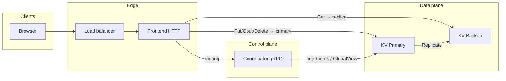

# 云存储系统 · Distributed Cloud Storage

Educational **distributed key-value / object storage** stack: replicated tablet storage nodes, a **Coordinator** for range-based routing, **WAL + checkpoint** crash recovery, and a **stateless web tier** (drive, webmail, admin, load balancer, optional SMTP).

---

## Repository layout

```
.
├── CMakeLists.txt              # Top-level build (project: distributed-cloud-storage)
├── cluster_config.csv          # Static partition ranges → primary / backups
├── proto/myproto/              # gRPC: KvStorage, Coordinator
├── server/src/                 # KV node, coordinator, router, tablet, wal, checkpoint, recovery
├── client/src/                 # KvStorageClient (routing + retries)
├── frontend/                   # HTTP server, storage, accounts, LB, SMTP, admin console
├── pages/                      # Static HTML for UI
├── docs/                       # (optional) local notes — not tracked if you use .gitignore
├── Dockerfile                  # Dev image: builds gRPC+Protobuf → /usr/local
├── run_docker_local.sh         # Recommended container workflow
└── run_docker.sh               # Optional: swap in your own toolchain image
```

---

## Architecture



| Component | Role |
|-----------|------|
| **Coordinator** | Loads `cluster_config.csv`, heartbeats, publishes **GlobalView** (range → primary + backups). |
| **KV `server`** | In-memory **Tablet**, **WAL** + **checkpoint**, synchronous **Replicate** to backups. |
| **Frontend** | Thread-pool HTTP; Drive uses **KvStorageClient** (row-based routing). |
| **Client library** | `GetClusterStatus` → stubs; writes target **primary**, reads use a live replica. |

---

## Durability: checkpoint & WAL (on-disk layout)

Each node uses **per-process files** derived from listen address (e.g. port only in filename): `checkpoint-<port>.bin`, `wal-<port>.log`.

### Checkpoint file (binary, `checkpoint.cpp`)

Written **atomically**: data goes to `*.tmp`, then `rename` over the final path.

| Field | Type | Meaning |
|-------|------|---------|
| `snapshot_lsn` | `int64` | **Tablet state is consistent with WAL up to this LSN** (inclusive semantics for replay: replay **strictly greater** than this). |
| `row_count` | `uint32` | Number of rows. |
| For each row | | |
| `row` | `uint32` length + bytes | Row key. |
| `col_count` | `uint32` | Columns in this row. |
| For each column | | |
| `col` | `uint32` len + bytes | Column key. |
| `val` | `uint32` len + bytes | Cell value (binary-safe). |

### WAL record (binary, `wal.cpp`)

Append-only log; each record ends with **fsync** on the log file (durability before replying on primary path).

| Field | Type | Meaning |
|-------|------|---------|
| `op` | `int` | `1` = PUT, `2` = DELETE, `3` = CPUT (matches `LogEntry` enum usage in recovery). |
| `row` | `uint32` len + bytes | Row key. |
| `col` | `uint32` len + bytes | Column key. |
| `v_old` | `uint32` len + bytes | CPUT expected value (empty for PUT/DELETE). |
| `v_new` | `uint32` len + bytes | New value for PUT/CPUT (empty for DELETE). |
| `lsn` | `int64` | Monotonic log sequence number (assigned in `Append` if `0`). |

### Recovery (`recovery.cpp`)

**LocalRecover**

1. `CheckpointManager::Load` → fills tablet, sets `last_snapshot_lsn_`.
2. `WAL::LoadAll` → for each record with **`lsn > checkpoint_lsn`**, apply PUT/DELETE/CPUT to tablet (same semantics as live path).

**RemoteRecoverFromPrimary** (backup catch-up)

1. Streaming `FetchSnapshot` → build temp map; last message carries `snapshot_lsn`.
2. Under lock: `wal.Clear()`, `wal.ResetToLSN(snapshot_lsn)`, `tablet.Clear()`, apply snapshot cells.
3. Paging `FetchWAL` from `snapshot_lsn + 1`, apply entries and **re-append** to local WAL so the node stays consistent.
4. `checkpoint.Save(tablet, wal.GetLastLSN())`.

### Checkpoint thread (`kv_server.cpp` — `CheckpointLoop`)

- Every **120s** (when running): `checkpoint_mgr_.Save(tablet, wal_.GetLastLSN())`, then **`wal_.Clear()`** (truncate file; **in-memory `last_lsn_` is not reset** — see `wal.h` comment).
- So after a checkpoint, the WAL file only holds **post-checkpoint** records; recovery stays “load checkpoint + replay tail”.

---

## Data model (tablet & Drive)

- **Tablet**: `Put/Get/Cput/Delete` on `(row, col)`; row-level `shared_mutex` + global index lock.
- **Drive** (see `frontend/storage.cc`): path → `file_id`; file bytes in **4 MiB** blocks with row key **`file_id:block_index`**, column **`b`**; optional legacy whole-file cell under `{user}-filedata` / `file_id` for old data.

---

## Authors

Yuxin Gao, Yikai Ding, Zihao Zhu, Xiaocheng Li.

---

## Build

Requires **CMake ≥ 3.13**, **C++17**, **gRPC** + **Protobuf** with **CMake CONFIG** packages (e.g. Homebrew, or the provided Dockerfile).

```bash
cmake -S . -B build
cmake --build build
```

### Docker (recommended if the host lacks CONFIG packages)

First image build compiles gRPC from source (slow once):

```bash
chmod +x run_docker_local.sh
./run_docker_local.sh
```

Inside the container (use a **clean** build dir; paths differ from macOS host):

```bash
cmake -S . -B build-docker && cmake --build build-docker
```

Image name defaults to **`cloud-storage-dev`** (override with `CLOUD_STORAGE_DEV_IMAGE`). Rebuild image: `./run_docker_local.sh --build`.

### macOS (Homebrew)

```bash
brew install cmake grpc protobuf
export CMAKE_PREFIX_PATH="$(brew --prefix grpc);$(brew --prefix protobuf)"
cmake -S . -B build && cmake --build build
```

### Optional third-party toolchain image

If you have access to a pre-built gRPC C++ image, mount this repo and run `cmake` there; see `run_docker.sh` as a template (edit `IMAGE` / paths).

---

## Run

**Coordinator**

```bash
./build/server/coordinator cluster_config.csv 0.0.0.0:5051
```

**KV nodes** (match `cluster_config.csv`)

```bash
./build/server/server 0.0.0.0:8081 localhost:5051
./build/server/server 0.0.0.0:8082 localhost:5051
```

**Frontends**

```bash
./build/frontend/frontend -p 8001 -b localhost:5051
```

**Load balancer**

```bash
./build/frontend/load_balancer -p 8080 -c frontend_servers.txt
```

Open `http://localhost:8080`. Admin UI: `/admin`.

**SMTP (optional)**

```bash
./build/frontend/smtp_server -p 2500 -r localhost:5051
```

---

## Screenshots


---

## License

Portfolio / educational use unless otherwise noted by the authors.
